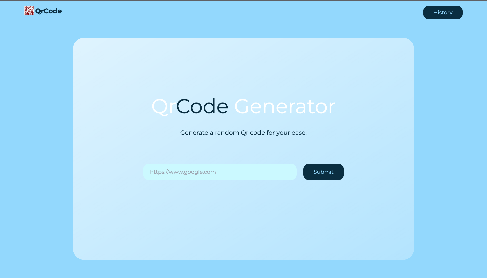

# Zinny Qrcodeapp

## Project setup

```
npm install
```

### Compiles and hot-reloads for development

```
npm run serve
```

### Compiles and minifies for production

```
npm run build
```

### Customize configuration

See [Configuration Reference](https://cli.vuejs.org/config/).

## Preview



## Documentation

`Code` Structure;
The QrCode app is made up of 2 components that includes (DashboardQr and QrCard), 2 views (HistoryQr and HomeView), a router folder that includes and index.js, a store folder that includes store.js

## Coding standard

Vue 2 was used for this project, plain Css and tailwindCss was also used to design the contents.
Router link was inputted in the App.vue folder.

## Implementation

Using the **global store**, i was able to establish a constant listener to the data needed for the qrs to be rendered...
and then, when some data is appended, it reflects in the store... causing both components to be in `sync`.
With this i was able to implement certain features like blocking the user when `limit has been reached`.

> Made by `@Zinnybliss ⚡`
